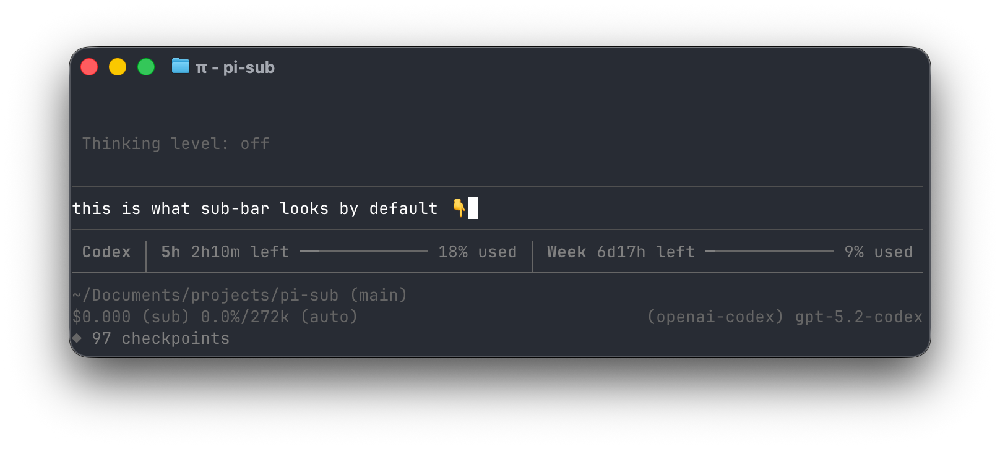
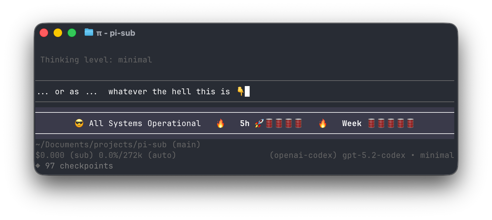

# sub-bar

Usage widget extension for [pi-coding-agent](https://github.com/badlogic/pi-mono/tree/main/packages/coding-agent).

Displays current provider usage in a widget below the editor. Fetching and caching are handled by `sub-core`.

### Impressions

https://github.com/user-attachments/assets/d61d82f6-afd0-45fc-82f3-69910543aa7a





## Overview

### Features

- Displays realtime usage quotas for multiple AI providers
- Auto-detects provider from current model (via sub-core)
- Shows rate limit windows with visual progress bars
- Status indicators from provider status pages
- Theme save/share/import and `sub-bar:import` preview flow
- Provider Shown selector to pin the displayed provider
- **Extensive settings UI** via `sub-bar:settings`
- Cycle through providers with `Ctrl+Alt+P`

### Supported Providers

| Provider | Usage Data | Status Page |
|----------|-----------|-------------|
| Anthropic (Claude) | 5h/7d windows, extra usage | ✅ |
| GitHub Copilot | Monthly quota, requests | ✅ |
| Google Gemini | Pro/Flash quotas | ✅ |
| Antigravity | Model quotas | ✅ |
| OpenAI Codex | Primary/secondary windows | ✅ |
| AWS Kiro | Credits | - |
| z.ai | Tokens/monthly limits | - |

### Provider Feature Matrix

| Provider | Usage Windows | Extra Info | Status Indicator | Tested | Notes |
|----------|--------------|------------|------------------|--------|-------|
| Anthropic (Claude) | 5h, 7d, Extra | Extra usage label | ✅ | ✅ | Extra usage can show on/off state |
| GitHub Copilot | Month | Model multiplier + requests left | ✅ | ✅ | Requests left uses model multiplier |
| Google Gemini | Pro, Flash | - | ✅ | - | Quotas aggregated per model family |
| Antigravity | Models | - | ✅ | - | Sandbox Cloud Code Assist quotas |
| OpenAI Codex | Primary, Secondary | - | ✅ | ✅ | Credits not yet supported (PRs welcome!) |
| AWS Kiro | Credits | - | - | - | - |
| z.ai | Tokens, Monthly | - | - | - | API quota limits |

## Installation

Install via the pi package manager (recommended). `sub-bar` depends on `sub-core` for data (it will not render without it):

```bash
pi install npm:@marckrenn/pi-sub-core
pi install npm:@marckrenn/pi-sub-bar
```

Use `-l` to install into project settings instead of global:

```bash
pi install -l npm:@marckrenn/pi-sub-core
pi install -l npm:@marckrenn/pi-sub-bar
```

Manual install (local development):

```bash
git clone https://github.com/marckrenn/pi-sub.git

ln -s /path/to/pi-sub/packages/sub-core ~/.pi/agent/extensions/sub-core
ln -s /path/to/pi-sub/packages/sub-bar ~/.pi/agent/extensions/sub-bar
```

Alternative (no symlink): add both to `~/.pi/agent/settings.json`:

```json
{
  "extensions": [
    "/path/to/pi-sub/packages/sub-core/index.ts",
    "/path/to/pi-sub/packages/sub-bar/index.ts"
  ]
}
```

## Usage

The extension loads automatically. Use:

- `sub-bar:settings` - Open display + provider UI settings (includes Provider Shown)
- `sub-bar:import <share string>` - Preview a shared theme and choose to save/apply
- `sub-core:settings` - Configure provider enablement/order + usage/status refresh settings
- `Ctrl+Alt+P` - Cycle through available providers
- `Ctrl+Alt+R` - Toggle reset timer format (relative vs datetime)

**Caching:**
- Handled by sub-core at `cache.json` next to the sub-core extension entry
- Cache TTL matches your auto-refresh interval setting
- Lock file prevents race conditions between multiple pi windows

## Communication with sub-core

`sub-bar` is a display client. It listens for `sub-core:update-current`/`sub-core:ready` events and renders the widget. On startup it requests the current state via `sub-core:request`.

`sub-bar` manages display settings and UI-only provider options (window visibility, labels, status indicator). Provider enablement lives in sub-core, but the sub-bar settings UI can toggle Enabled (auto/on/off) and forwards changes to `sub-core:settings:patch`. Ordering and refresh behavior are configured in `sub-core:settings`, and sub-core broadcasts updates that sub-bar consumes. The cycle command forwards to `sub-core:action` so core updates provider selection and then broadcasts the new state.

## Settings

Display and provider UI settings are persisted next to the extension entry (`settings.json` in the same folder as `index.ts`). Core settings are managed by sub-core, and the sub-bar settings menu includes a shortcut that points you to `sub-core:settings` for additional options.

**Settings migrations:** settings are merged with defaults on load, but renames/removals are not migrated automatically. When adding new settings or changing schema, update the defaults/merge logic and provide a migration (or instruct users to reset `settings.json`).

### Provider UI Settings

Use `sub-bar:settings` → Provider Settings to control enabled state (auto/on/off), status indicators, and per-provider window visibility.

### Core Settings

Use `sub-core:settings` to configure provider enablement (auto/on/off), fetch status, usage refresh settings, status refresh settings, and provider order.

### Display Settings

Use Display Settings → Theme to save, load, import, and randomize display themes.

Display Settings cover layout, bars, labels/text, reset timers, status indicators, dividers, and color tuning. Open `sub-bar:settings` → Display Settings to explore the full list in the UI.

## Credentials

Credentials are loaded by sub-core from:

- `~/.pi/agent/auth.json` - pi's auth file
- Provider-specific locations (e.g., `~/.codex/auth.json`, `~/.gemini/oauth_creds.json`)
- macOS Keychain for Claude Code credentials
- Environment variables (e.g., `Z_AI_API_KEY`)

## Development

### Packaging notes (pi install compatibility)

Pi packages use a `pi` field in `package.json` plus the `pi-package` keyword for discoverability. This repo already declares `pi.extensions`, so you can install via:

```bash
pi install npm:@marckrenn/pi-sub-core
pi install npm:@marckrenn/pi-sub-bar
```

Manual paths/symlinks still work for local development as documented above.

### Architecture

```
sub-bar/
├── index.ts              # Extension entry point (display client)
├── src/
│   ├── formatting.ts     # UI formatting
│   ├── status.ts         # Status indicator helpers
│   ├── utils.ts          # Display helpers
│   ├── providers/        # Display metadata + visibility rules
│   ├── settings/         # Settings UI helpers
│   ├── settings-types.ts # Settings type definitions
│   ├── settings.ts       # Settings persistence
│   └── usage/types.ts    # Shared usage types
├── package.json
└── tsconfig.json
```

### Adding a New Provider

Update both sub-core (fetch) and sub-bar (display). See `sub-core/README.md` for the full checklist.

### Feature placement (UI vs core)

- **sub-bar** owns presentation (formatting, layout, status indicators, UI settings).
- **sub-core** owns data fetching, caching, provider selection, and shared settings/events.
- Add shared types to **sub-shared** when both layers reference them.

See the root README “Developer guide” for the full decision checklist and examples.

### Commands

```bash
npm run check
```

## Credits

- ~Hannes~ Helmut Januschka ([usage-bar.ts](https://github.com/hjanuschka/shitty-extensions?tab=readme-ov-file#usage-barts), [@hjanuschka](https://x.com/hjanuschka))
- Peter Steinberger ([CodexBar](https://github.com/steipete/CodexBar), [@steipete](https://x.com/steipete))

## License

MIT
